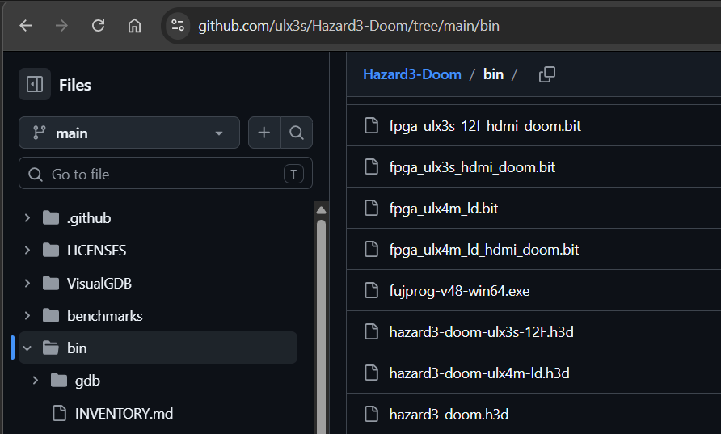
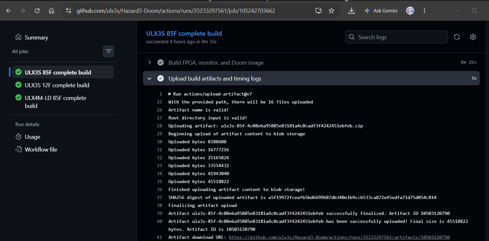
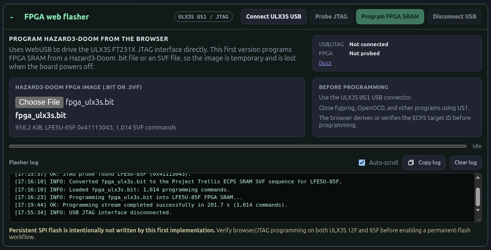
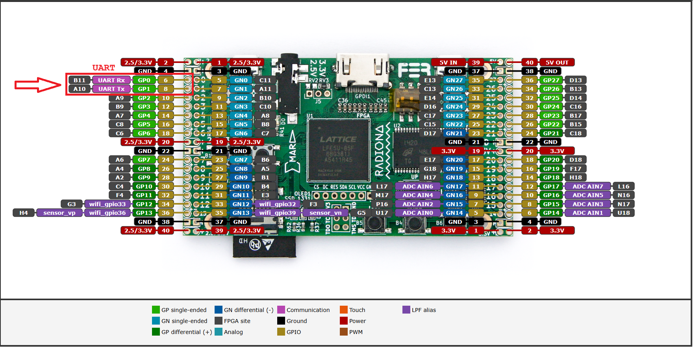
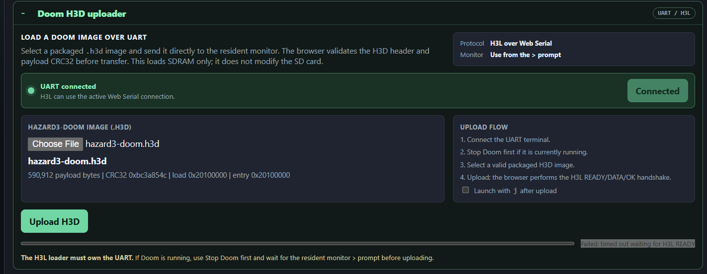
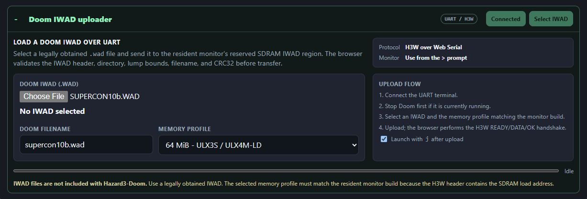
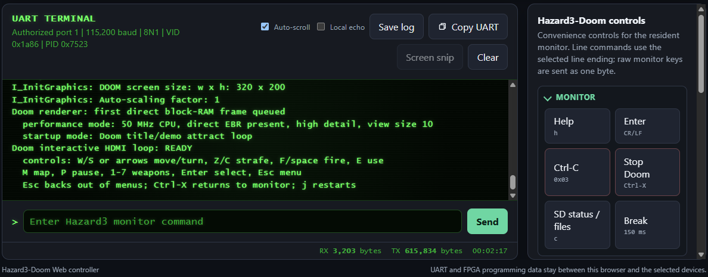

No-install Quick Start - ULX3S
==============================

The fastest way to try Hazard3-Doom on a ULX3S is to use the project's
prebuilt files and the browser-based Device Tool. You do **not** need to clone
the repository or install Yosys, nextpnr, the RISC-V compiler, Python upload
scripts, OpenOCD, or GDB for this path.

This page programs the FPGA temporarily, uploads Doom to SDRAM, and starts it.
Nothing in this procedure changes the ULX3S SPI flash, so the FPGA image is lost
when power is removed.

.. note::

   A current Chromium-based browser such as Chrome or Edge is required. On
   Windows, the ULX3S ``US1`` FT231X may need to use the WinUSB driver before
   WebUSB can access it. This is a USB-driver configuration step, not an FPGA or
   RISC-V development-toolchain installation. See :doc:`../user-guide/web-flasher`.

What you need
-------------

* a ULX3S 85F or ULX3S 12F board;
* an HDMI display;
* the ULX3S ``US1`` USB connection for FPGA WebUSB programming;
* an external USB-to-UART adapter connected to the Hazard3-Doom UART;
* a matching prebuilt ``.bit`` file and ``.h3d`` file; and
* a legally obtained Doom IWAD such as ``DOOM.WAD`` or ``DOOM1.WAD``.

See :doc:`../user-guide/pinouts` for the UART connections and
:doc:`../user-guide/web-tool` for the complete browser-tool reference.

1. Get the prebuilt files
-------------------------

The repository ``bin/`` directory is the preferred source for the project's
published prebuilt images:

`Browse the Hazard3-Doom bin directory <https://github.com/ulx3s/Hazard3-Doom/tree/main/bin>`_

Use ``bin/INVENTORY.md`` and the accompanying checksum inventory to identify the
published files and verify what each file is for:

`View bin/INVENTORY.md <https://github.com/ulx3s/Hazard3-Doom/blob/main/bin/INVENTORY.md>`_

For the current ULX3S prebuilt images, select the pair matching the FPGA on your
board:

.. list-table::
   :header-rows: 1
   :widths: 18 39 43

   * - Board
     - FPGA image
     - Doom H3D image
   * - ULX3S 85F
     - ``fpga_ulx3s_hdmi_doom.bit``
     - ``hazard3-doom-ulx3s-85F.h3d``
   * - ULX3S 12F
     - ``fpga_ulx3s_12f_hdmi_doom.bit``
     - ``hazard3-doom-ulx3s-12F.h3d``

Do not mix files from different board profiles. The browser flasher probes the
physical ECP5 JTAG ID and rejects a ``.bit`` file whose embedded target does not
match the FPGA it detected.

.. _fig-no-install-bin-prebuilt-files:

   Published prebuilt ULX3S images in the repository ``bin/`` directory, together
   with ``INVENTORY.md`` for file identification and verification.

Recent GitHub Actions builds
~~~~~~~~~~~~~~~~~~~~~~~~~~~~

The **Board integration builds** GitHub Actions workflow is a second source for
recent successful build output:

`Open Board integration builds <https://github.com/ulx3s/Hazard3-Doom/actions/workflows/fpga-builds.yml>`_

Open a successful run and download the artifact for the exact board profile you
want to test, then extract the downloaded archive. Workflow artifacts are useful for testing a recent CI build, but
they are not the permanent download location: GitHub Actions artifacts have a
retention period and disappear when their retained run or artifact expires or
is deleted. The published ``bin/`` files are therefore the simpler choice for a
normal first run.

.. _fig-no-install-actions-artifacts:

   The Board integration builds workflow can also provide recent ULX3S build
   artifacts for testing.

2. Open the Device Tool
-----------------------

Open the hosted browser application:

`Hazard3-Doom Device Tool <https://ulx3s.github.io/Hazard3-Doom/>`_

For this no-install path, all required operations run directly in the browser.
You do not need ``web-server.py``, OpenOCD, or GDB. Those tools are only needed
for the optional console-firmware ELF debugging/loading workflow.

3. Program the FPGA SRAM
------------------------

Connect the ULX3S ``US1`` USB port, then in the Device Tool:

#. Expand **Device uploading**.
#. Expand **FPGA web flasher**.
#. Select the matching ``.bit`` file.
#. Choose **Connect ULX3S USB** and select the ULX3S FTDI device.
#. Choose **Probe JTAG** and confirm the detected FPGA is the expected device.
#. Choose **Program FPGA SRAM**.
#. Wait for the flasher log to report successful completion.

The FPGA configuration is volatile. Power cycling the board returns it to its
normal persistent configuration.

.. _fig-no-install-web-flasher:

   The browser FPGA flasher after probing JTAG and selecting the matching ULX3S
   ``.bit`` file.

4. Connect the UART
-------------------

Hazard3-Doom uses the ULX3S ``J1`` GPIO header for its external UART. Use a
3.3 V USB-to-UART adapter and cross the TX/RX signals:

.. code-block:: text

   USB-UART TXD  ->  J1 pin 6  / GP0 / B11 -> Hazard3 uart_rx
   USB-UART RXD  <-  J1 pin 8  / GP1 / A10 <- Hazard3 uart_tx
   USB-UART GND  ->  ULX3S GND
   USB-UART VCC  ->  not connected

.. _fig-ulx3s-uart-pinout:

   **ULX3S Hazard3-Doom UART** -- GP0 is the FPGA receive input and GP1 is the
   FPGA transmit output.

Expand **Serial connection** and connect at the normal Hazard3-Doom settings:

.. code-block:: text

   115200 baud
   8 data bits
   no parity
   1 stop bit
   no flow control

The resident monitor is already embedded in the normal Hazard3-Doom FPGA image.
A successful start should produce the monitor banner and a ``>`` prompt. You do
not need to load ``hazard3-boot-monitor.elf`` for this procedure.

If no prompt appears, see :doc:`../troubleshooting` and
:doc:`../user-guide/web-serial` before continuing.

5. Upload the Doom H3D image
----------------------------

Under **Device uploading**, expand **Doom H3D uploader**:

#. Select the matching ``hazard3-doom-*.h3d`` file.
#. Choose **Upload H3D**.
#. Wait for the monitor to accept the image.

Keep the H3D image matched to the same board profile as the ``.bit`` file.

.. _fig-no-install-h3d-upload:

   Uploading the board-matched ``hazard3-doom-*.h3d`` image through the Device
   Tool.

6. Upload your Doom IWAD
------------------------

Expand **Doom IWAD uploader** and select your legally obtained ``.wad`` file.
Choose the memory profile matching the resident monitor:

.. list-table::
   :header-rows: 1
   :widths: 45 25

   * - Board
     - Memory profile
   * - ULX3S 85F
     - ``64m``
   * - ULX3S 12F
     - ``32m``

Choose **Upload IWAD**. To start Doom as soon as the transfer completes, enable
**Launch with ``j`` after upload** before starting the upload.

The project does not distribute the commercial Doom IWAD. You must supply a
legally obtained IWAD yourself.

.. _fig-no-install-iwad-upload:

   Uploading a Doom IWAD with the correct monitor memory profile and optional
   automatic launch enabled.

7. Verify Doom starts
---------------------

A healthy upload and launch includes monitor output similar to:

.. code-block:: text

   H3L READY
   H3L DATA
   H3L OK
   H3W READY
   H3W DATA
   H3W OK
   Doom SDRAM image startup
   monitor ABI: PASS
   Doom interactive HDMI loop: READY

At this point Doom should be visible over HDMI and the browser terminal can
remain connected for monitor and diagnostic commands.

.. _fig-no-install-doom-running:

   Doom running after a successful FPGA program, H3D upload, and IWAD upload.

What this path does not install
-------------------------------

This quick start deliberately avoids the development environment. It does not
install or require:

* Yosys or nextpnr;
* Project Trellis build tools;
* a RISC-V GCC toolchain;
* the Hazard3-Doom source checkout or submodules;
* the command-line Doom upload scripts; or
* OpenOCD/GDB for the normal boot-monitor/H3D/IWAD path.

When you are ready to rebuild or modify the FPGA, monitor firmware, or Doom
image, continue with :doc:`quick-start` and :doc:`build`.

ULX4M-LD
--------

Prebuilt ULX4M-LD images can also avoid a local FPGA build, but the current
ULX4M-LD programming path still uses host DFU tools. It is therefore not the
same browser-only no-install workflow described above. See
:doc:`programming` for ULX4M-LD DFU programming and persistent boot.

Related documentation
---------------------

* :doc:`../user-guide/web-tool` - complete Device Tool reference.
* :doc:`../user-guide/web-flasher` - ULX3S WebUSB, WinUSB, target checks, and troubleshooting.
* :doc:`../user-guide/web-serial` - UART/Web Serial operation and troubleshooting.
* :doc:`../user-guide/pinouts` - ULX3S UART and JTAG pin connections.
* :doc:`quick-start` - install the development tools and build everything from source.
* :doc:`programming` - temporary and persistent board programming methods.
