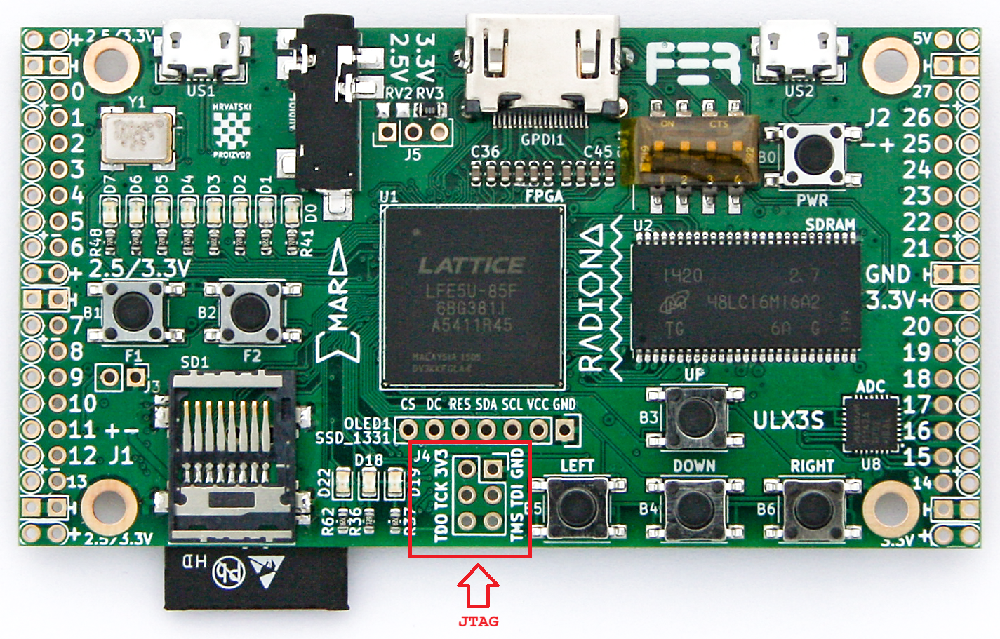
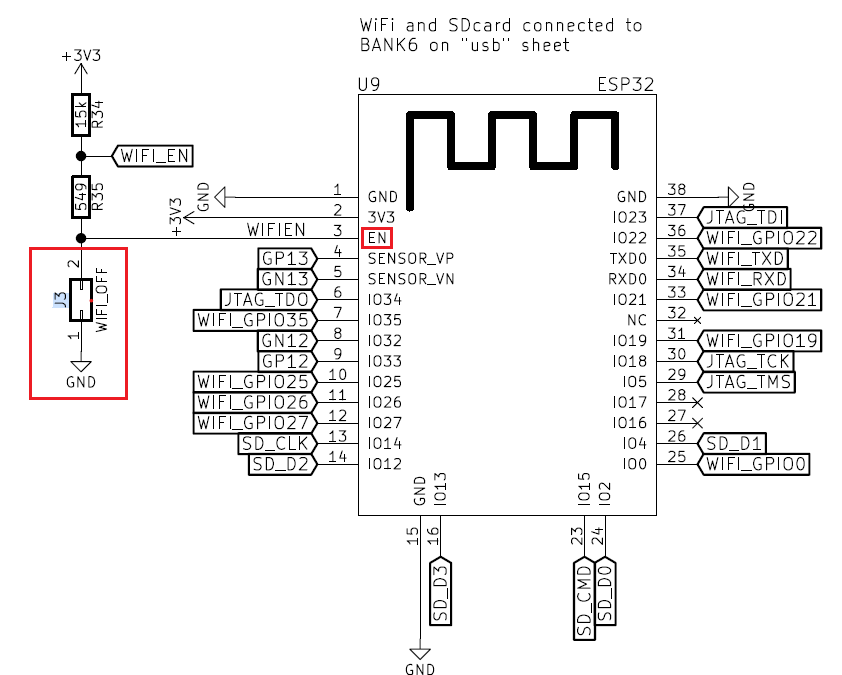

JTAG Debugging
==============

Hazard3 includes a RISC-V Debug Module and Debug Transport Module. On ECP5
boards, Hazard3 exposes the RISC-V DTM through the ECP5 chip JTAG TAP and the
``JTAGG`` primitive. OpenOCD therefore sees the physical ECP5 TAP first and then
uses the ECP5 private ER1/ER2 instructions to reach Hazard3 DTMCS and DMI.

For an explanation of the hardware path, abstract commands, instruction
injection, system-bus access, and which debug features are selected in this
bitstream, see :doc:`../architecture/hazard3/debug`.

OpenOCD and GDB
---------------

GDB connects to OpenOCD over TCP, normally ``localhost:3333``. GDB does not
open the USB JTAG adapter directly. The USB driver and adapter configuration
therefore belong to OpenOCD, while ``scripts/load-firmware.sh`` uses GDB only
after OpenOCD has successfully examined the target.

For ULX3S, the preferred launcher is:

.. code-block:: bash

   ./scripts/start-openocd.sh

The launcher is intentionally usable from both WSL and native Linux. On native
Linux it resolves ``openocd`` from ``PATH``. Under WSL it can use the bundled
Windows ``openocd.exe`` for a Windows-mounted checkout when WSL interop is
available; otherwise it uses native Linux OpenOCD. This keeps repository paths
and executable formats matched to the host environment.

The project ULX3S configurations are written to work with the Ubuntu OpenOCD
``0.12.0`` release and the newer OpenOCD builds currently used by the project. In particular, the
``gdb_report_data_abort`` compatibility spelling is accepted by 0.12.0; newer
builds may print a deprecation warning while continuing to accept it. Do not
replace a distro OpenOCD installation merely to eliminate that warning.

With OpenOCD already running and no other GDB client attached:

.. code-block:: bash

   ./scripts/load-firmware.sh

Or provide an explicit ELF:

.. code-block:: bash

   ./scripts/load-firmware.sh /path/to/hazard3-boot-monitor.elf

The batch loader halts the target, loads the ELF, verifies the loaded sections
with ``compare-sections``, sets ``$pc`` to ``_start``, resumes the processor,
and disconnects.

ULX3S on-board FT231X
---------------------

On ULX3S, the project uses the board's normal FT231X USB/JTAG connection. The
current ``ft232r`` OpenOCD path has been verified on Windows with **WinUSB** and
**libusbK**. WinUSB is convenient when the same FT231X is also used by the
Hazard3-Doom WebUSB FPGA flasher. The default FTDI VCP/D2XX binding is for
FTDI-native tools such as Windows ``fujprog`` and is not the libusb OpenOCD
path.

See :doc:`web-flasher` for the ULX3S driver compatibility matrix.

A healthy ULX3S 85F OpenOCD start includes output similar to:

.. code-block:: text

   JTAG tap: lfe5u85.hazard3 tap/device found: 0x41113043
   Examined RISC-V core; found 1 harts
   hart 0: XLEN=32
   Listening on port 3333 for gdb connections

In a VM, an initial USB transaction can occasionally report
``LIBUSB_ERROR_TIMEOUT`` or a failed all-zero JTAG interrogation. Judge the final
state, not just the first warning: if OpenOCD subsequently examines the RISC-V
core and opens port 3333, the debug server is usable. A clean immediate restart
is a useful confirmation. If the TAP/core is never found, verify that the
FT231X is attached to the guest, the browser FPGA flasher is disconnected, and
no other process owns the JTAG interface.

ULX3S with external Tigard
---------------------------

Tigard can be used instead of the onboard FT231X. This is particularly useful
for comparing debug adapters, avoiding FT231X driver changes, or using a faster
FT2232H MPSSE JTAG path. The wiring follows the published Tigard and ULX3S JTAG
pinouts; qualify this external-adapter path on the target board before treating
it as a project-tested configuration.

J4 is the physical external JTAG header, not a separate JTAG controller. Its
``TCK``, ``TMS``, ``TDI``, and ``TDO`` signals connect to the ECP5 chip's hard
JTAG TAP. They are dedicated JTAG pins rather than ordinary user GPIO, so the
Hazard3 ECP5 debug path does not route them through normal LPF ``LOCATE``
constraints. The ULX3S reference LPF likewise leaves those dedicated sites
commented out as user GPIO.

With Hazard3 configured for the ECP5 debug transport, the path is:

.. code-block:: text

   Tigard / FT2232H
          |
          v
      ULX3S J4
          |
          v
   ECP5 hard JTAG TAP
          |
          v
       JTAGG
          |
          v
   Hazard3 ECP5 JTAG DTM
          |
          v
   RISC-V Debug Module
          |
          v
      Hazard3 CPU

``JTAGG`` is the FPGA-fabric connection to the existing ECP5 TAP; Hazard3 does
not create a second external TAP. Hazard3 maps the RISC-V ``DTMCS`` and ``DMI``
data registers onto the ECP5 ``ER1`` and ``ER2`` user data-register hooks,
selected by instructions ``0x32`` and ``0x38``. Standard TAP functions such as
IDCODE and BYPASS remain provided by the ECP5 TAP. This is also why OpenOCD
first identifies the ECP5 and then uses the private instructions to reach the
RISC-V debugger.

This differs from Hazard3's generic ``DTM_TYPE="JTAG"`` mode, where a normal
RISC-V JTAG DTM is connected to four user I/O ports. For ULX3S the ECP5 mode
instantiates ``hazard3_ecp5_jtag_dtm`` and ``JTAGG`` internally, so J4 connects
to the ECP5 TAP rather than directly to RISC-V JTAG pins.

Wire Tigard's JTAG header directly to ULX3S J4:

.. code-block:: text

   Tigard GND (pin 2, black)    -> ULX3S J4 GND
   Tigard TCK (pin 3, white)    -> ULX3S J4 TCK
   Tigard TDI (pin 4, grey)     -> ULX3S J4 TDI
   Tigard TDO (pin 5, purple)   <- ULX3S J4 TDO
   Tigard TMS (pin 6, blue)     -> ULX3S J4 TMS
   Tigard VTGT                  -> not connected
   Tigard TRST / SRST           -> not connected

.. _fig-ulx3s-jtag-pinout:

   **ULX3S external JTAG** -- ``J4`` is the physical header for the ECP5 hard
   JTAG TAP. Use its dedicated TCK, TDI, TDO, and TMS pins for the Tigard
   connection; these are not ordinary FPGA GPIO.

Set Tigard to ``SPI/JTAG`` mode and 3.3 V logic. Power ULX3S normally from
US1. See :doc:`pinouts` for the J4 physical layout and wiring cautions.

The Tigard adapter portion of an OpenOCD configuration is:

.. code-block:: text

   adapter driver ftdi
   transport select jtag
   ftdi vid_pid 0x0403 0x6010
   ftdi channel 1
   ftdi layout_init 0x0038 0x003b
   ftdi layout_signal nTRST -data 0x0010
   ftdi layout_signal nSRST -data 0x0020
   adapter speed 1000

The Hazard3 target portion is the same as ``openocd/ulx3s-openocd.cfg``: the
ECP5 TAP has an 8-bit instruction register, and Hazard3 DTMCS/DMI are reached
through ECP5 private instructions ``0x32`` and ``0x38``. For an 85F ULX3S, the
ECP5 IDCODE is ``0x41113043``. A 12F board uses ``0x21111043`` instead.

After OpenOCD reports the ECP5 TAP, examines one 32-bit RISC-V hart, and opens
port 3333, connect the project's RISC-V GDB to the ELF. With the exact GDB
executable supplied by the installed RISC-V toolchain, the interactive flow is
conceptually:

.. code-block:: text

   $ riscv-none-elf-gdb path/to/hazard3-boot-monitor.elf
   (gdb) target extended-remote localhost:3333
   (gdb) monitor halt
   (gdb) break main
   (gdb) continue
   (gdb) next
   (gdb) stepi
   (gdb) info registers
   (gdb) continue

``next`` and ``step`` operate at source level when debug information is
available; ``nexti`` and ``stepi`` operate one machine instruction at a time.
This is true single-step debugging of the Hazard3 RISC-V core running inside
the FPGA. The external Tigard still enters through the ECP5 JTAG TAP; it does
not connect directly to RISC-V pins.

Debugging the onboard ULX3S ESP32 with Tigard
----------------------------------------------

The onboard ESP32 is a completely separate JTAG target from Hazard3. It is a
classic dual-core Xtensa ESP32, so use Espressif's ESP32 OpenOCD support and an
Xtensa GDB, not the RISC-V GDB used for Hazard3. This connection is derived
from the ULX3S schematic/LPF and Espressif's documented JTAG pins; it has not
yet been project-qualified on ULX3S.

ESP32 native JTAG uses:

.. code-block:: text

   TDI -> GPIO12 / MTDI
   TCK -> GPIO13 / MTCK
   TMS -> GPIO14 / MTMS
   TDO <- GPIO15 / MTDO

On ULX3S these four ESP32 signals are shared with the microSD interface. The
practical Tigard connection therefore reaches them through the SD signals:

.. code-block:: text

   Tigard TDI (pin 4, grey)    -> SD DAT2 -> ESP32 GPIO12
   Tigard TCK (pin 3, white)   -> SD DAT3 -> ESP32 GPIO13
   Tigard TMS (pin 6, blue)    -> SD CLK  -> ESP32 GPIO14
   Tigard TDO (pin 5, purple)  <- SD CMD  <- ESP32 GPIO15
   Tigard GND (pin 2, black)   -> board GND

The corresponding microSD contacts are DAT2 pin 1, DAT3 pin 2, CMD pin 3,
CLK pin 5, and VSS/GND pin 6. A breakout or extension is much easier and safer
than probing the socket contacts directly. Remove the SD card.

.. warning::

   The ECP5 is connected to the same SD signals. Do not debug the ESP32 over
   these wires while the FPGA may be driving the SD bus. Use or verify an FPGA
   image that leaves ``SD_D2``, ``SD_D3``, ``SD_CLK``, and ``SD_CMD`` high
   impedance. The normal Hazard3-Doom design uses SD, so this needs deliberate
   isolation before connecting Tigard.

Holding the ESP32 in reset with J3
~~~~~~~~~~~~~~~~~~~~~~~~~~~~~~~~~~

If SD card problems are encountered on the FPGA side, the ULX3S ``J3`` jumper
can be used to hold the ESP32 in reset. ``J3`` is a 2-pin header that grounds
the ESP32 ``EN`` signal when shorted. This disables the ESP32 and can help
isolate it from the shared SD bus while troubleshooting or while giving the
FPGA exclusive SD-card ownership.

.. _fig-ulx3s-j3-wifi-off:

   **ULX3S J3 (WIFI_OFF) jumper** -- shorting ``J3`` pulls the ESP32 ``EN``
   signal low, holding the ESP32 in reset/disabled state.

Tigard ``SRST`` may optionally be connected to the ``WIFI_OFF``/EN side of the
ULX3S J3 jumper for hardware reset. ESP32 ``EN`` is an active-high enable
signal; pulling it low resets/disables the chip. Do not connect the reset wire
to the J3 ground side, and do not connect Tigard ``VTGT`` when the ULX3S is
self-powered.

With Espressif OpenOCD installed, the configuration is equivalent to:

.. code-block:: bash

   openocd \
       -f interface/ftdi/tigard.cfg \
       -c "set ESP32_FLASH_VOLTAGE 3.3" \
       -f target/esp32.cfg

Then use the ELF produced by the ESP32 build:

.. code-block:: text

   $ xtensa-esp32-elf-gdb path/to/esp32-app.elf
   (gdb) target remote localhost:3333
   (gdb) monitor halt
   (gdb) break app_main
   (gdb) continue
   (gdb) next
   (gdb) stepi

The ``ESP32_FLASH_VOLTAGE`` setting matters because GPIO12/TDI is also an ESP32
boot-strapping input. Espressif's OpenOCD configuration uses the flash-voltage
setting to keep the JTAG TDI idle state appropriate for a 3.3 V flash device.

ULX4M-LD with Tigard
--------------------

The ULX4M Micro-B DFU connection is the FPGA configuration/bootloader path. It
is **not** the Hazard3 JTAG debug adapter. For ULX4M-LD debugging, use an
external Tigard FT2232H.

Known-good Tigard setup
~~~~~~~~~~~~~~~~~~~~~~~

Use these settings:

.. list-table::
   :header-rows: 1
   :widths: 35 65

   * - Item
     - Setting
   * - Tigard mode selector
     - ``JTAG``
   * - Tigard target power
     - ``OFF``; do not power the ULX4M from Tigard
   * - Target reference voltage
     - 3.3 V
   * - USB VID:PID
     - ``0403:6010``
   * - OpenOCD FTDI channel
     - ``1`` (FT2232H channel B / USB Interface 1)
   * - JTAG clock
     - 1000 kHz
   * - ECP5 device
     - LFE5UM-85F
   * - ECP5 IDCODE
     - ``0x01113043``
   * - Hazard3 DTMCS/DMI instructions
     - ``0x32`` / ``0x38``

The correct LFE5UM-85F IDCODE is ``0x01113043``. Do not use the
``0x41113043`` value associated with a different ECP5 device variant.

Windows driver split
~~~~~~~~~~~~~~~~~~~~

Tigard exposes two independent FT2232H USB interfaces. Configure them once and
leave them that way:

.. list-table::
   :header-rows: 1
   :widths: 25 25 25 25

   * - USB interface
     - FT2232H channel
     - Windows driver
     - Project use
   * - Interface 0
     - A
     - FTDI VCP
     - UART COM port
   * - Interface 1
     - B
     - libusbK
     - OpenOCD JTAG

This allows PuTTY/Web Serial on the UART and OpenOCD JTAG at the same time;
there is no reason to keep changing drivers between them. If libusbK is
accidentally installed on Interface 0, the UART COM port disappears. Restore
Interface 0 to the FTDI USB Serial/VCP driver and leave Interface 1 on libusbK.

.. _fig-zadig-tigard-libusbk:

.. figure:: ../images/Zadig-Tigard-set-interface-1-libusbk.png
   :alt: Zadig selecting libusbK for Tigard Interface 1
   :class: screenshot

   Apply libusbK to Tigard Interface 1 for JTAG. Keep Interface 0 on the FTDI
   VCP driver for the UART COM port.

ULX4M-LD UART through Tigard
~~~~~~~~~~~~~~~~~~~~~~~~~~~~

Tigard's UART interface is independent of its JTAG channel. Use 115200 8N1,
no flow control. On the Waveshare Raspberry Pi-style 40-pin header, the
confirmed wiring is:

.. code-block:: text

   Tigard UART TX (yellow)  -> physical pin 16 -> GPIO23 -> FPGA N4 -> uart_rx
   Tigard UART RX (orange)  <- physical pin 18 -> GPIO24 <- FPGA N3 <- uart_tx
   Tigard GND               -> physical pin 20
   Tigard VCC               -> not connected

TX and RX must be crossed exactly as shown. See :doc:`pinouts` for the annotated
ULX4M-LD carrier pinout.

ULX4M-LD OpenOCD configuration
~~~~~~~~~~~~~~~~~~~~~~~~~~~~~~

The project configuration is:

.. code-block:: bash

   ./bin/openocd.exe -d2 \
       -f ./third_party/Hazard3/example_soc/ulx4m-openocd-tigard.cfg

The important configuration values are equivalent to:

.. code-block:: text

   adapter driver ftdi
   ftdi vid_pid 0x0403 0x6010
   ftdi channel 1
   ftdi layout_init 0x0038 0x003b
   ftdi layout_signal nTRST -data 0x0010
   ftdi layout_signal nSRST -data 0x0020

   transport select jtag
   adapter speed 1000

   set _CHIPNAME lfe5um85
   jtag newtap $_CHIPNAME hazard3 \
       -expected-id 0x01113043 \
       -irlen 8 \
       -irmask 0xFF \
       -ircapture 0x5

   set _TARGETNAME $_CHIPNAME.hazard3
   target create $_TARGETNAME riscv -chain-position $_TARGETNAME
   riscv set_ir dtmcs 0x32
   riscv set_ir dmi 0x38

   gdb_report_data_abort enable
   init
   halt

The established Tigard wiring does **not** connect a target reset wire. Do not
rely on SRST/TRST to reset or start the ULX4M design; the FTDI layout entries
remain part of the adapter configuration, but reset is not physically wired to
the target in this setup.

A healthy session reaches output similar to:

.. code-block:: text

   JTAG tap: lfe5um85.hazard3 tap/device found: 0x01113043
   Examined RISC-V core; found 1 hart
   XLEN=32
   Listening on port 3333 for gdb connections

The known-good Hazard3 DTMCS value is ``0x00004071``.

Interpreting ``dtmcontrol is 0``
~~~~~~~~~~~~~~~~~~~~~~~~~~~~~~~~

The ECP5 hard JTAG TAP can return the chip IDCODE even when the Hazard3 user
bitstream is not running. Therefore this combination is diagnostically useful:

.. code-block:: text

   JTAG IDCODE = 0x01113043
   dtmcontrol = 0

It proves that the physical Tigard-to-ECP5 JTAG path is alive, but does **not**
prove that the Hazard3 ``JTAGG``/DTM user logic is active. Before changing the
DTM RTL or JTAG wiring, confirm that the ULX4M user bitstream has actually been
started. If the board is still in its DFU bootloader, run:

.. code-block:: bash

   ./bin/dfu-util.exe -a 0 -e

Then retry OpenOCD. In the validated bring-up sequence, leaving DFU this way
started the user design, restored the Hazard3 UART, and made the user FPGA
logic available for further testing.

If the user design is visibly running on UART but DTMCS is still zero, use the
raw ECP5 ER1/DTMCS scan or compare with a previously known-good OpenOCD build
before modifying the Hazard3 RTL.

Building and loading a clock-matched monitor
~~~~~~~~~~~~~~~~~~~~~~~~~~~~~~~~~~~~~~~~~~~~~

The current qualified ULX4M-LD FPGA profile runs Hazard3/AHB at 40 MHz. Build a
matching software-only monitor without rerouting the FPGA:

.. code-block:: bash

   HAZARD3_BUILD_DIR="$PWD/build/ulx4m-ld-40mhz/monitor" \
   HAZARD3_MEMORY_PROFILE=64m \
   HAZARD3_SYS_CLK_HZ=40000000 \
       ./scripts/build.sh

Then, with OpenOCD already examining the target:

.. code-block:: bash

   ./scripts/load-firmware.sh \
       ./build/ulx4m-ld-40mhz/monitor/hazard3-boot-monitor.elf

A successful load reports matching ``.vectors``, ``.text``, read-only data,
and ``.data`` sections before resuming from address ``0x00000040``.

VisualGDB
---------

Windows users can use the project files under ``VisualGDB/`` with Visual
Studio. The debugger still talks to the same OpenOCD/GDB target, so the
command-line path remains the reference workflow. Disconnect VisualGDB before
running the batch firmware loader, because only one GDB client should own the
OpenOCD target at a time.

The GDB startup helper is:

.. code-block:: text

   scripts/hazard3-debug.gdb

Troubleshooting
---------------

If the debug module is not detected reliably, first distinguish physical TAP
access from Hazard3 DTM access. A correct ECP5 IDCODE with DTMCS zero is a
different failure from an adapter that cannot read the ECP5 IDCODE at all.
Reduce the JTAG clock only after checking the active FPGA image, Tigard driver
split, and target power/reference settings.

See :doc:`../troubleshooting` for common OpenOCD and ownership problems.

External References
-------------------

* `ULX3S manual <https://github.com/emard/ulx3s/blob/master/doc/MANUAL.md>`_
* `ULX3S v2.x/v3.0 constraints <https://github.com/emard/ulx3s/blob/master/doc/constraints/ulx3s_v20.lpf>`_
* `Hazard3 ECP5 JTAG DTM <https://github.com/Wren6991/Hazard3/blob/stable/hdl/debug/dtm/hazard3_ecp5_jtag_dtm.v>`_
* `Hazard3 example SoC DTM selection <https://github.com/Wren6991/Hazard3/blob/stable/example_soc/soc/example_soc.v>`_
* `Tigard pinout and usage <https://github.com/tigard-tools/tigard>`_
* `Espressif ESP32 JTAG pin mapping <https://docs.espressif.com/projects/esp-idf/en/stable/esp32/api-guides/jtag-debugging/configure-other-jtag.html>`_
* `yosys nextpnr supported primitives <https://github.com/YosysHQ/nextpnr/blob/main/ecp5/docs/primitives.md>`_
