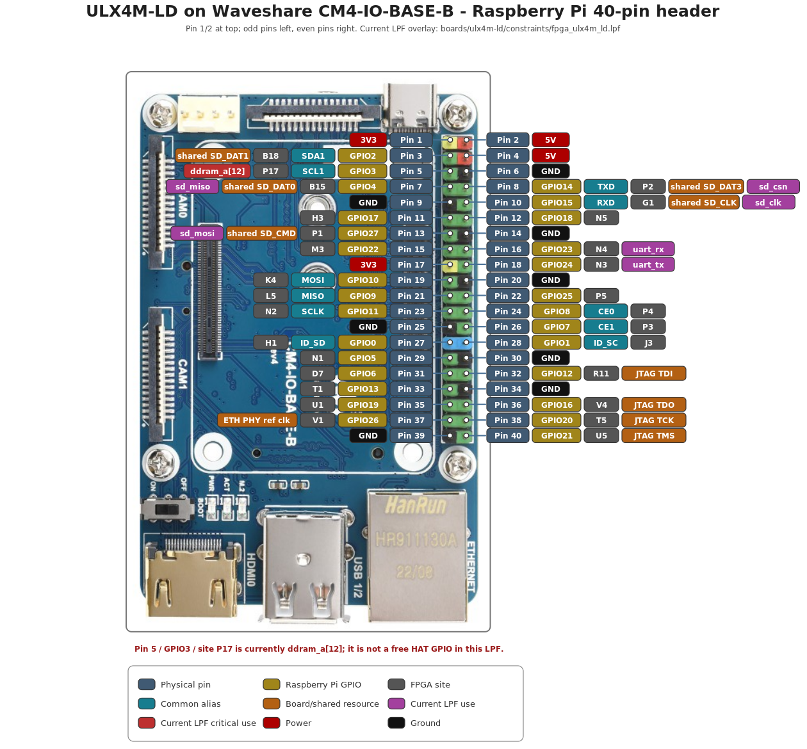

Board Pinouts and Wiring
=========================

This page collects the pinout diagrams and the project-tested connections most
useful when attaching UART adapters, SAOs, debug hardware, or other external
devices. It is a practical wiring reference; the hardware guide remains the
authoritative project reference for PCB revisions, schematics, LPF constraints,
and FPGA package-ball assignments.

ULX3S
-----

.. _fig-ulx3s-pinout:

.. figure:: ../images/ulx3s-pinout.png
   :alt: ULX3S pinout

   **ULX3S Pinout** - FPGA GPIO and connector pin assignments.

The project-tested Hazard3-Doom monitor UART uses these J1 connections:

.. code-block:: text

   adapter TX  -> J1 pin 6 / GP0 -> Hazard3 RxD
   adapter RX  <- J1 pin 8 / GP1 <- Hazard3 TxD
   adapter GND -> adjacent J1 GND

TX and RX are named from the perspective of each device, so they must be
crossed as shown. For schematic, LPF, header-orientation, and board-revision
details, see :doc:`../hardware/ulx3s/pinout-and-revisions`.

Tigard JTAG to Hazard3 on ULX3S
~~~~~~~~~~~~~~~~~~~~~~~~~~~~~~~

The ULX3S J4 header is the direct external JTAG connection to the ECP5. Hazard3
uses the ECP5 hard JTAG TAP plus the ``JTAGG`` primitive to expose its RISC-V
Debug Transport Module, so the Tigard connects to J4 rather than to J1/J2.

The ULX3S manual gives the J4 signal layout as::

   3V3  GND
   TCK  TDI
   TDO  TMS

With Tigard in ``SPI/JTAG`` mode, use these connections. This follows the
published Tigard and ULX3S JTAG pinouts; it should be treated as a wiring
reference until the external-Tigard path is qualified in Hazard3-Doom.

.. list-table:: Tigard to ULX3S J4 for Hazard3 debugging
   :header-rows: 1
   :widths: 20 20 20 40

   * - Tigard pin
     - Tigard signal
     - Wire color
     - ULX3S J4
   * - 2
     - GND
     - Black
     - GND
   * - 3
     - TCK
     - White
     - TCK
   * - 4
     - TDI
     - Grey
     - TDI
   * - 5
     - TDO
     - Purple
     - TDO
   * - 6
     - TMS
     - Blue
     - TMS

Power the ULX3S normally from US1. Set Tigard for 3.3 V logic, but leave its
``VTGT`` wire disconnected so Tigard does not power the board. ``TRST`` and
``SRST`` are not required for the Hazard3 connection. Keeping US1 connected
also keeps the onboard FT231X powered; the ULX3S documentation notes that an
unpowered FT231X can load the shared JTAG signals on some board revisions.

See :doc:`jtag-debugging` for OpenOCD and GDB single-step examples.

Tigard JTAG to the onboard ESP32
~~~~~~~~~~~~~~~~~~~~~~~~~~~~~~~~

This is a separate debug target. The classic ESP32 on ULX3S is an Xtensa
processor; it does not use the Hazard3/ECP5 JTAG path. Its native JTAG pins are
GPIO12 through GPIO15, and ULX3S shares those four signals with the microSD
socket. The mapping below is derived from the ULX3S schematic/LPF and the
Espressif ESP32 JTAG pinout; it has not yet been project-qualified on ULX3S:

.. list-table:: Tigard to ULX3S onboard ESP32
   :header-rows: 1
   :widths: 18 18 18 20 26

   * - Tigard
     - JTAG signal
     - ESP32 pin
     - ULX3S SD signal
     - microSD contact
   * - Pin 4 / grey
     - TDI
     - GPIO12 / MTDI
     - DAT2
     - Pin 1
   * - Pin 3 / white
     - TCK
     - GPIO13 / MTCK
     - DAT3
     - Pin 2
   * - Pin 6 / blue
     - TMS
     - GPIO14 / MTMS
     - CLK
     - Pin 5
   * - Pin 5 / purple
     - TDO
     - GPIO15 / MTDO
     - CMD
     - Pin 3
   * - Pin 2 / black
     - GND
     - GND
     - VSS
     - Pin 6, or another board GND

A microSD breakout or extension is preferable to probing the card socket
contacts directly. Remove the SD card before using these signals for ESP32
JTAG.

.. warning::

   The same SD signals are also connected to the ECP5. Do not attach or drive
   the Tigard JTAG signals while an FPGA image may be actively driving the SD
   bus. Before attempting ESP32 JTAG debugging, use or verify an FPGA image
   that leaves ``SD_D2``, ``SD_D3``, ``SD_CLK``, and ``SD_CMD`` high impedance.
   The normal Hazard3-Doom image uses the SD interface, so do not assume this
   condition is satisfied.

ESP32 ``EN`` is the active-low reset input. ULX3S exposes it through the J3
``WIFI_OFF`` jumper, so Tigard ``SRST`` can optionally be wired to the
``WIFI_OFF``/EN side of J3 for hardware reset. Basic JTAG attachment does not
require this connection. Identify the EN side of J3 before wiring it; do not
connect ``SRST`` to the J3 ground side.

GPIO12 is also an ESP32 boot-strapping pin related to SPI-flash voltage. When
using OpenOCD, keep the ESP32 flash-voltage setting at 3.3 V and avoid allowing
an external adapter to force an incorrect TDI level during reset.

ULX4M-LD on the Waveshare CM4 carrier
--------------------------------------

.. _fig-ulx4m-ld-pinout:

   **ULX4M-LD Pinout** - FPGA pin assignments on the
   `Waveshare CM4 Carrier <https://www.waveshare.com/wiki/CM4-IO-BASE-A#Dimension>`_.

For the project-tested Tigard UART connection on the Waveshare Raspberry
Pi-style 40-pin header:

.. code-block:: text

   Tigard UART TX  -> physical pin 16 -> GPIO23 -> FPGA N4 -> uart_rx
   Tigard UART RX  <- physical pin 18 -> GPIO24 <- FPGA N3 <- uart_tx
   Tigard GND      -> physical pin 20
   Tigard VCC      -> not connected

Do not power the ULX4M from Tigard. For module revisions, schematics, LPF
constraints, and carrier assumptions, see
:doc:`../hardware/ulx4m/pinout-and-revisions`. For the complete OpenOCD/Tigard
setup, see :doc:`jtag-debugging`.

Generate Custom Pinouts
-----------------------

The pinout diagrams can be regenerated or adapted with the standalone
`ULX Pinout Generator <https://github.com/ulx3s/ulx3s-pinout>`_. The tool builds
annotated diagrams from board-specific constraint files, connector maps, board
images, and layout information rather than maintaining one hand-edited pinout.
It currently supports ULX3S and ULX4M-LD.

The generator is useful when you want to:

* regenerate the published diagram from its source data;
* select a different ULX3S board-revision LPF;
* inspect aliases or electrical metadata recorded in an LPF;
* see which ULX4M-LD header-connected FPGA sites are consumed by a particular
  design LPF;
* produce SVG, PNG, PDF, or PostScript output; or
* adjust label placement, widths, colors, or other diagram geometry.

.. warning::

   Generated diagrams are documentation aids, not a replacement for the board
   schematic or the actual constraint file used to build the FPGA image.
   Before connecting hardware, verify connector power, FPGA sites, the PCB
   revision, connector orientation, shared resources, and the selected LPF.

How the generator works
~~~~~~~~~~~~~~~~~~~~~~~

Mapping generation and diagram rendering are deliberately separate steps. The
normal flow is:

.. code-block:: text

   board constraint file
           |
           v
   boards/<board>/generator.py
           |
           v
   boards/<board>/data.py
           |
           +---------------- board image
           +---------------- styles.css
           |
           v
   boards/<board>/layout.py
           |
           v
   output/<board>/pinout_*.{svg,png,pdf,ps}

``generate-data-from-lpf.py`` selects the board-specific LPF parser and writes
the generated mapping data. ``generate-pinout.py`` loads the selected board's
``layout.py`` and renders the existing ``data.py``. Rendering does **not**
silently select or regenerate an LPF configuration, so regenerate the mapping
data first whenever you change the LPF or mapping options.

Run all commands from the root of the ``ulx3s-pinout`` repository. Board
configuration uses repository-relative paths.

Install on Ubuntu or WSL
~~~~~~~~~~~~~~~~~~~~~~~~

The normal workflow is Python-based. On Ubuntu or WSL:

.. code-block:: bash

   sudo apt update
   sudo apt install python3-pip

   cd /mnt/c/workspace
   git clone https://github.com/ulx3s/ulx3s-pinout.git
   cd ulx3s-pinout

   python3 -m pip install --user --upgrade pinout cairosvg pillow

The dependencies have distinct roles:

* ``pinout`` builds the diagram object model and exports SVG;
* ``cairosvg`` provides PNG, PDF, and PostScript conversion; and
* ``Pillow`` validates images and normalizes the ULX4M-LD carrier photograph
  before calibrated connector coordinates are applied.

List the supported boards at any time with:

.. code-block:: bash

   ./generate-data-from-lpf.py --list-boards
   ./generate-pinout.py --list-boards

ULX3S quick start
~~~~~~~~~~~~~~~~~

The default ULX3S data is generated from the v3.1.6/v3.1.7 LPF configuration
and includes recognized aliases used by the committed pinout:

.. code-block:: bash

   ./generate-data-from-lpf.py ulx3s \
       --include aliases \
       --markdown output/ulx3s/PIN-MAPPING.md

Render the default SVG:

.. code-block:: bash

   ./generate-pinout.py ulx3s

Or render a PNG:

.. code-block:: bash

   ./generate-pinout.py ulx3s --format png

The normal outputs are:

.. code-block:: text

   output/ulx3s/pinout_ulx3s.svg
   output/ulx3s/pinout_ulx3s.png
   output/ulx3s/PIN-MAPPING.md

The generated SVG embeds the board image, so it can be viewed without a network
connection.

Use another ULX3S LPF
~~~~~~~~~~~~~~~~~~~~~

The repository contains multiple ULX3S constraint files under
``boards/ulx3s/constraints/``, including v1.7-patch, v2.0, v3.1.4, and v3.1.6
variants. To generate from a specific checked-in LPF, pass it explicitly:

.. code-block:: bash

   ./generate-data-from-lpf.py ulx3s \
       boards/ulx3s/constraints/ulx3s_v20.lpf \
       --include aliases \
       --markdown output/ulx3s/PIN-MAPPING-v20.md

   ./generate-pinout.py ulx3s --format png

To experiment without replacing the committed ULX3S ``data.py``, write the
mapping to a temporary file:

.. code-block:: bash

   ./generate-data-from-lpf.py ulx3s \
       boards/ulx3s/constraints/ulx3s_v20.lpf \
       -o build/ulx3s-v20-data.py

That temporary file is useful for inspection and comparison. The renderer uses
the board's normal ``boards/ulx3s/data.py`` unless the board implementation is
changed to consume something else.

ULX3S optional LPF labels
~~~~~~~~~~~~~~~~~~~~~~~~~

The base diagram does not have to display every piece of LPF metadata. Use
``--include`` to select additional fields. Ask the installed generator for the
authoritative current list with:

.. code-block:: bash

   ./generate-data-from-lpf.py ulx3s --list-fields

The current fields include:

.. code-block:: text

   aliases
   connector
   flags
   iobuf
   pullmode
   io_type
   drive
   frequency
   comment
   all

Useful examples follow.

Include aliases only:

.. code-block:: bash

   ./generate-data-from-lpf.py ulx3s \
       boards/ulx3s/constraints/ulx3s_v316.lpf \
       --include aliases

Include aliases plus commonly useful electrical metadata:

.. code-block:: bash

   ./generate-data-from-lpf.py ulx3s \
       boards/ulx3s/constraints/ulx3s_v316.lpf \
       --include aliases,connector,flags,pullmode,io_type,drive,frequency

Include every parsed ``IOBUF`` key/value pair:

.. code-block:: bash

   ./generate-data-from-lpf.py ulx3s \
       boards/ulx3s/constraints/ulx3s_v316.lpf \
       --include iobuf

Request a specific arbitrary ``IOBUF`` key:

.. code-block:: bash

   ./generate-data-from-lpf.py ulx3s \
       boards/ulx3s/constraints/ulx3s_v316.lpf \
       --iobuf-key SLEWRATE

The fields have these meanings:

* ``aliases`` combines recognized aliases in GP/GN comments with other active
  ``LOCATE COMP`` names that use the same FPGA site. Duplicate aliases are
  emitted only once.
* ``connector`` emits connector labels such as ``J1_5+``, ``J1_5-``,
  ``J2_35+``, and ``J2_35-``. When an LPF comment supplies an explicit
  connector token, the generator verifies it against the physical template.
* ``flags`` extracts useful comment flags such as ``DIFF``, ``PCLK``, and
  ``GR_PCLK``.
* ``iobuf`` emits all parsed ``IOBUF`` key/value pairs. ``pullmode``,
  ``io_type``, and ``drive`` select narrower subsets.
* ``frequency`` emits ``FREQUENCY PORT`` metadata where present.
* ``comment`` emits the complete GP/GN inline comment. It can make labels very
  wide and is mainly useful for auditing.
* ``all`` enables every supported optional field, including the raw comment.

ULX3S vector and scalar GPIO forms
~~~~~~~~~~~~~~~~~~~~~~~~~~~~~~~~~~

Some ULX3S LPFs contain both vector and scalar names for the same GPIOs:

.. code-block:: text

   gp[0]..gp[27] / gn[0]..gn[27]
   gp0..gp27     / gn0..gn27

The generator verifies that the two forms resolve to the same FPGA ``SITE``.
For aliases and electrical metadata, however, the forms are not blindly
merged. ``--gpio-form auto`` is the default and prefers the complete vector
form.

Select a form explicitly when needed:

.. code-block:: bash

   ./generate-data-from-lpf.py ulx3s --gpio-form vector
   ./generate-data-from-lpf.py ulx3s --gpio-form scalar

The v3.1.6/v3.1.7 LPF currently contains a known GN12 metadata difference. The
vector form specifies ``PULLMODE=UP``, ``IO_TYPE=LVCMOS33``, and ``DRIVE=4``
without a ``FREQUENCY`` entry, while the scalar form specifies
``PULLMODE=NONE``, ``IO_TYPE=LVCMOS33``, and ``FREQUENCY=50 MHZ``. The normal
generator reports this as a warning, and the repository test suite expects the
warning.

To make any vector/scalar metadata disagreement fatal, add:

.. code-block:: bash

   --strict-form-metadata

ULX3S physical numbering and validation
~~~~~~~~~~~~~~~~~~~~~~~~~~~~~~~~~~~~~~~

The generated ULX3S mapping follows the constraint-file convention for female
angled 90-degree J1/J2 headers mounted on the top of the board. If you use male
vertical headers on the bottom of the PCB or a flat cable, verify orientation
before wiring. Viewing the connector from the opposite side can reverse the
apparent left/right relationship.

The generator validates these important invariants:

.. code-block:: text

   J1 contains physical pins 1..40 exactly once
   J2 contains physical pins 1..40 exactly once
   GP0..GP27 appear exactly once
   GN0..GN27 appear exactly once

The GPIO ranges are:

.. code-block:: text

   J1: GP0..GP13 and GN0..GN13
   J2: GP14..GP27 and GN14..GN27

Always verify FPGA package sites against the selected LPF rather than inferring
a site from neighboring pins.

ULX3S project/user labels
~~~~~~~~~~~~~~~~~~~~~~~~~

Project-specific labels are separate from LPF-derived metadata. This is how the
generator can show semantic annotations such as the UART labels for GP0 and
GP1 without pretending those project meanings are part of the board constraint
file.

Suppress project/user labels with:

.. code-block:: bash

   ./generate-data-from-lpf.py ulx3s --no-user-labels

Use ``--include`` for information derived from the LPF and the user-label
mechanism for project-specific meanings.

ULX4M-LD quick start
~~~~~~~~~~~~~~~~~~~~

Generate the default ULX4M-LD mapping and Markdown table:

.. code-block:: bash

   ./generate-data-from-lpf.py ulx4m-ld \
       --markdown output/ulx4m-ld/PIN-MAPPING.md

Render SVG or PNG output:

.. code-block:: bash

   ./generate-pinout.py ulx4m-ld
   ./generate-pinout.py ulx4m-ld --format png

The normal outputs are:

.. code-block:: text

   output/ulx4m-ld/pinout_ulx4m_ld.svg
   output/ulx4m-ld/pinout_ulx4m_ld.png
   output/ulx4m-ld/PIN-MAPPING.md

The ULX4M-LD generator intentionally keeps two layers separate:

* the fixed Raspberry Pi header -> CM4 -> ULX4M-LD FPGA-site wiring; and
* the current LPF use of those FPGA sites.

This matters because a site physically connected to the 40-pin header can also
be consumed by another design resource. The selected LPF determines the active
resource names shown in that layer of the diagram; they are not hard-coded into
the drawing.

Generate all supported boards
~~~~~~~~~~~~~~~~~~~~~~~~~~~~~

Once each board's ``data.py`` contains the mapping you want, render all boards
with:

.. code-block:: bash

   ./generate-pinout.py all

Again, this renders the existing board data. It does not regenerate each board
from an LPF.

Output formats and filenames
~~~~~~~~~~~~~~~~~~~~~~~~~~~~

The renderer supports:

.. code-block:: text

   svg
   png
   pdf
   ps

Examples:

.. code-block:: bash

   ./generate-pinout.py ulx3s --format svg
   ./generate-pinout.py ulx3s --format png
   ./generate-pinout.py ulx4m-ld --format pdf
   ./generate-pinout.py ulx4m-ld --format ps

For a custom filename when generating one board:

.. code-block:: bash

   ./generate-pinout.py ulx4m-ld \
       --format svg \
       --output output/ulx4m-ld/custom.svg

Generation normally overwrites the selected output file. Use
``--no-overwrite`` to retain the existing file and allow ``pinout.manager`` to
choose a unique output name.

Advanced direct pinout.manager use
~~~~~~~~~~~~~~~~~~~~~~~~~~~~~~~~~~

``generate-pinout.py`` is the preferred board-oriented front end, but each
board ``layout.py`` also exposes the module-level ``diagram`` object expected by
the original ``pinout.manager`` workflow.

ULX3S:

.. code-block:: bash

   python3 -m pinout.manager \
       --export boards/ulx3s/layout.py output/ulx3s/pinout_ulx3s.svg \
       --overwrite

ULX4M-LD:

.. code-block:: bash

   python3 -m pinout.manager \
       --export boards/ulx4m-ld/layout.py output/ulx4m-ld/pinout_ulx4m_ld.svg \
       --overwrite

Customize the diagrams
~~~~~~~~~~~~~~~~~~~~~~

Treat the LPFs, board-specific generator code, board images, layout code, and
``styles.css`` as source. Regenerate ``data.py`` and the output images instead
of making permanent edits directly to generated SVG or PNG files.

For mapping or LPF-derived label changes, work in:

.. code-block:: text

   boards/ulx3s/generator.py
   boards/ulx3s/constraints/*.lpf

   boards/ulx4m-ld/generator.py
   boards/ulx4m-ld/constraints/*.lpf

For placement and geometry, edit the board layout:

.. code-block:: text

   boards/ulx3s/layout.py
   boards/ulx4m-ld/layout.py

The layout owns diagram dimensions, board-image placement, label-group
positions, leader-line geometry, semantic label widths, label height and
spacing, board centering, legend placement, and board-specific calibration
coordinates.

ULX3S label widths are selected by semantic type. The layout includes width
controls such as:

.. code-block:: text

   PIN_NUMBER_LABEL_WIDTH
   GPIO_SIGNAL_LABEL_WIDTH
   FPGA_SITE_LABEL_WIDTH
   POWER_LABEL_WIDTH
   GROUND_LABEL_WIDTH
   USER_LABEL_WIDTH
   ALIAS_LABEL_WIDTH
   CONNECTOR_LABEL_WIDTH
   METADATA_LABEL_WIDTH
   ANALOG_LABEL_WIDTH
   PWM_LABEL_WIDTH
   TOUCH_LABEL_WIDTH
   DEFAULT_LABEL_WIDTH

ULX3S pill geometry is also parameterized in ``boards/ulx3s/layout.py``,
including corner radius, border color, and border width. Shared visual styling
such as GP/GN colors, differential-pair colors, FPGA-site colors, power and
ground, aliases, connector metadata, leader lines, fonts, and legend styling
lives in ``styles.css``.

When changing ULX4M-LD placement, keep the measured Raspberry Pi header endpoint
calibration separate from label placement. The connector coordinates are what
keep leader lines attached to the correct pins in the carrier photograph.

Validate changes
~~~~~~~~~~~~~~~~

Run the same parser and rendering checks used by the repository's GitHub Actions
workflow:

.. code-block:: bash

   ./scripts/test-pinout.sh

Temporary validation output is written below:

.. code-block:: text

   build/pinout-tests/

The test suite checks Python syntax, board discovery, command-line help, SVG and
PNG rendering for both boards, PNG readability, reproducibility of the
committed default ``data.py`` files, Markdown mapping generation, every
checked-in ULX3S and ULX4M-LD constraint file, the ULX3S aliases path,
ShellCheck when available, and that the tests do not modify tracked files.

A successful run produces at least these rendered files:

.. code-block:: text

   build/pinout-tests/rendered/pinout_ulx3s.svg
   build/pinout-tests/rendered/pinout_ulx3s.png
   build/pinout-tests/rendered/pinout_ulx4m_ld.svg
   build/pinout-tests/rendered/pinout_ulx4m_ld.png

Before committing a pinout change, also inspect the diagrams visually. Confirm
that the board image is present, connector labels point to the intended holes,
J1/J2 and GP/GN counts are complete, FPGA package sites agree with the
constraint file, and power/ground assignments agree with the schematic for the
intended board revision. Automated checks complement, rather than replace,
visual and schematic verification.

Troubleshooting
~~~~~~~~~~~~~~~

``module '<name>' has no attribute 'diagram'``
   ``pinout.manager`` requires a module-level object named ``diagram``. Each
   board ``layout.py`` must expose it.

PNG, PDF, or PS export fails while SVG succeeds
   The CairoSVG conversion path is stricter about some CSS syntax than modern
   browsers. Use conventional comma-separated RGB values such as
   ``rgb(34, 173, 0)`` rather than CSS Color 4 space-separated values such as
   ``rgb(34 173 0)``.

ULX3S reports the GN12 metadata warning
   This is the known v3.1.6/v3.1.7 vector/scalar metadata difference described
   above. It is allowed by the normal test suite. Use
   ``--strict-form-metadata`` when you intentionally want the difference to
   fail generation.

``data.py`` reproducibility test fails
   The committed board data must be reproducible using the repository's default
   generation options. For ULX3S, the committed default includes
   ``--include aliases``. The test prints a diff when generated data does not
   match the committed file.

Labels render but the board image is missing
   Confirm the board-specific image exists:

   .. code-block:: bash

      ls -lh boards/ulx3s/ulx3s.png
      ls -lh boards/ulx4m-ld/cm4-io-base-b-3_3.jpg

   Both layouts embed the board image in the generated SVG.

A browser still shows an older SVG
   Local SVG files can be cached. Reload the file or close and reopen the
   browser tab after regeneration.

The repository contains older helper directories such as ``fpga2pinout/``,
``svg2png/``, and ``png2base64/``. They are legacy utilities and are not
required by the current Python-based ULX3S or ULX4M-LD generation workflow.

Before connecting external hardware
-----------------------------------

* Confirm the exact board and PCB revision.
* Confirm the active FPGA bitstream and LPF constraints.
* Check I/O voltage and signal direction before making a connection.
* Connect grounds before relying on UART or other single-ended signals.
* Do not assume a connector position has the same function across board or
  carrier revisions.

The diagrams are convenient visual references, but the active constraints and
the schematic for the hardware in front of you determine the actual electrical
connection.

External References
-------------------

* `ULX3S hardware manual <https://github.com/emard/ulx3s/blob/master/doc/MANUAL.md>`_
* `ULX3S hardware sources <https://github.com/emard/ulx3s>`_
* `ULX Pinout Generator <https://github.com/ulx3s/ulx3s-pinout>`_
* `Tigard hardware/debug adapter <https://github.com/tigard-tools/tigard>`_
* `ESP32 JTAG pin mapping <https://docs.espressif.com/projects/esp-idf/en/stable/esp32/api-guides/jtag-debugging/configure-other-jtag.html>`_
* `ULX4M hardware sources <https://github.com/intergalaktik/ulx4m>`_
* `Waveshare CM4-IO-BASE-A Schematic <https://files.waveshare.com/upload/a/aa/CM4-IO-BASE-A_V4_SchDoc.pdf>`_
* `Waveshare CM4-IO-BASE-A carrier <https://www.waveshare.com/wiki/CM4-IO-BASE-A>`_
