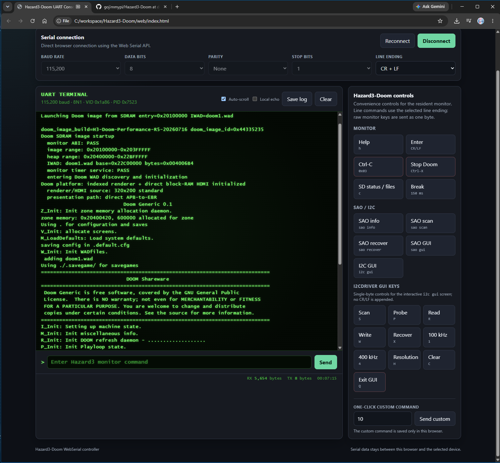

Web Device Tool
===============

Hazard3-Doom includes a browser-based Device Tool in the repository ``web/``
directory. It brings the most common board bring-up and interactive tasks into
one page instead of requiring a separate terminal and several command-line
upload tools.

.. _fig-hazard3-doom-web-console:

   **Hazard3-Doom Device Tool** - Web Serial console, monitor controls, and
   device actions in one browser interface.

A public HTTPS build is hosted on GitHub Pages:

`Open the Hazard3-Doom Device Tool <https://ulx3s.github.io/Hazard3-Doom/>`_

The hosted page can be used directly for FPGA SRAM programming, Doom H3D/IWAD
upload, and UART terminal access. Console firmware loading is the one workflow
that also needs the local ``web-server.py`` loopback helper, because the browser
cannot start or control local GDB/OpenOCD processes directly.

The helper binds only to loopback and listens on ``127.0.0.1:8000`` by default.
It accepts only explicitly allowed browser origins; the defaults include the
Hazard3-Doom GitHub Pages origins and its own exact loopback origin. An optional
access key can provide additional protection. See `Optional local-loader access
key`_ below.

The current page provides four main areas:

* **Device uploading** - FPGA SRAM programming, console firmware loading, Doom
  H3D upload, and Doom IWAD upload.
* **Serial connection** - Web Serial port selection and UART settings.
* **UART terminal** - live monitor/Doom output, command entry, logging, and HDMI
  screen snip.
* **Hazard3-Doom controls** - one-click monitor, SAO, and I2CDriver commands.

The **Device uploading** and **Serial connection** panels are collapsible. The
individual uploaders inside **Device uploading** are collapsible as well. Major
actions are kept in the section headers, the full page scrolls normally, and
flasher/firmware logs can be resized vertically when more or less history is
useful.

Short hover text is used throughout the page. Transport badges explain what
path a section uses, enabled buttons describe the action they perform, and a
disabled button explains why it is not currently available.

Transport overview
------------------

The web tool uses three independent device paths:

.. code-block:: text

   Browser page (localhost or HTTPS/GitHub Pages)
     |
     +-- Web Serial --> USB-UART --> resident monitor / Doom
     |                  |             |
     |                  |             +-- H3L .h3d upload
     |                  |             +-- H3W .wad upload
     |                  |             +-- terminal / commands / screen snip
     |
     +-- WebUSB ------> ULX3S US1 FT231X --> ECP5 JTAG --> FPGA SRAM
     |
     +-- loopback HTTP --> web-server.py --> GDB --> OpenOCD --> Hazard3 debug
                           127.0.0.1:8000             :3333
                           console firmware ELF only

Web Serial and WebUSB communicate directly from the browser to devices selected
in the browser permission dialogs. The console firmware uploader is different:
a browser cannot directly start GDB or OpenOCD, so it calls the project's local
``web-server.py`` helper over loopback HTTP.

The browser page itself does **not** have to be served by ``web-server.py``.
The public HTTPS page can use the helper running on the same computer. This is
why the page can remain at GitHub Pages while GDB/OpenOCD continue to run only
on the user's machine.

Browser and serving requirements
--------------------------------

Use a current Chromium-based browser such as Chrome or Edge. Web Serial and
WebUSB require a secure context. HTTPS satisfies that requirement for the hosted
tool, and ``localhost``/loopback is accepted for local development.

UART access, H3D/IWAD upload, screen snip, and FPGA WebUSB programming do not
need a local web server. The browser performs those operations directly.

Console firmware loading additionally requires the local helper. From the
repository root, start:

.. code-block:: bash

   python3 web/web-server.py

After it starts, either continue using the public GitHub Pages Device Tool or
open the same page locally at ``http://127.0.0.1:8000/``.

A browser using the public HTTPS page may ask for permission to access a local
network or loopback service. Grant that permission if the console firmware
loader is needed.

To allow a different development origin explicitly, for example:

.. code-block:: bash

   python3 web/web-server.py --allow-origin http://127.0.0.1:9000

A wildcard origin is intentionally not accepted.

Optional local-loader access key
~~~~~~~~~~~~~~~~~~~~~~~~~~~~~~~~

For additional protection, start the helper with an access key:

.. code-block:: bash

   python3 web/web-server.py --access-key

The helper prompts for the key without echoing it. Enter the same key in the
**Console firmware uploader**. The browser keeps the key only in page memory;
it is not saved in ``localStorage``.

Passing a key directly on the command line is also supported, but is less
desirable because shell history or process listings may expose it:

.. code-block:: bash

   python3 web/web-server.py --access-key 'example-key'

Independently of the key, the helper binds only to loopback, checks the
browser ``Origin`` against an exact allow-list, and requires the expected
local-loader request headers.

.. warning::

   Do not double-click ``web/index.html`` or use a ``file://`` URL for the
   complete Device Tool. Serve the page from HTTPS or localhost so Web Serial,
   WebUSB, and the loopback loader API receive the browser security context they
   expect.

Local-loader health checks
~~~~~~~~~~~~~~~~~~~~~~~~~~

The **Console firmware uploader** periodically checks the loopback helper and
also provides a **refresh** control. Each check carries a fresh ``challenge``
value and the helper echoes it in the response. This prevents a stale cached
``Ready`` response from making a stopped helper appear alive.

Server log lines such as the following are therefore normal:

.. code-block:: text

   GET /api/console-firmware/status?challenge=... HTTP/1.1

Once a helper has reported **Ready**, the page continues to revalidate it. If
``web-server.py`` stops, the status returns to unavailable without requiring a
page reload.

Serial connection
-----------------

Expand **Serial connection** and choose the UART device.

.. figure:: ../images/webserial-connect.png
   :alt: Hazard3-Doom Web Serial device selection
   :class: screenshot

   **Web Serial connection** - select the board UART before using the terminal
   or the H3D/IWAD uploaders.

The normal Hazard3-Doom settings are:

.. code-block:: text

   115200 baud
   8 data bits
   no parity
   1 stop bit
   no flow control

The page also exposes the command line ending separately. ``CR + LF`` is the
normal interactive setting.

**Connect** opens the browser serial-device chooser. **Reconnect** opens the
selected port from the ports that the current browser origin has already been
authorized to use. Reconnect is disabled while the UART is already connected,
and its hover text explains that state.

Only one application can own a serial port at a time. The Device Tool uses a
same-origin browser lock and ``BroadcastChannel`` coordination so a second copy
of the same Device Tool can warn that another tab already owns the UART. If the
competing owner is another origin, PuTTY, or another application, the browser
cannot identify that process, but a failed serial ``open()`` is reported as a
likely port-ownership conflict.

``http://127.0.0.1:8000`` and ``https://ulx3s.github.io`` are different
browser origins, so their tab locks cannot coordinate with each other. The
underlying serial-port open failure still protects the port from being opened by
both at once.

The H3D and IWAD sections also show the UART prerequisite prominently. When no
UART is connected they provide their own **Connect UART** control; when the UART
is connected the section header reflects that state.

Device uploading
----------------

Expand **Device uploading** to access the four upload/programming workflows.
They are intentionally separate because they use different transports and have
different persistence rules.

FPGA web flasher
~~~~~~~~~~~~~~~~

The **FPGA web flasher** accepts a ULX3S ECP5 ``.bit`` or compatible ``.svf``
file and programs FPGA **SRAM** through the board's ``US1`` FT231X JTAG
interface using WebUSB.

The browser probes the physical ECP5 JTAG ID and, for a ``.bit`` file, verifies
that the bitstream target matches the FPGA before programming. The programmed
image starts immediately but is lost when power is removed. Persistent SPI
flash is intentionally not written by this control.

On Windows, the ULX3S FT231X used by WebUSB must be bound to WinUSB. This driver
choice is separate from the external USB-UART adapter used by Web Serial.

The browser WebUSB flasher and OpenOCD cannot own the same ULX3S FT231X at the
same time. After programming FPGA SRAM, use **Disconnect** in the flasher before
starting OpenOCD. WinUSB can support both paths, but ownership is handed from the
browser to OpenOCD rather than shared concurrently.

See :doc:`web-flasher` for target IDs, Windows driver compatibility, the JTAG
sequence, and troubleshooting.

Console firmware uploader
~~~~~~~~~~~~~~~~~~~~~~~~~

The **Console firmware uploader** loads ``hazard3-boot-monitor.elf`` through the
Hazard3 debug module. It does not ask the running monitor to replace itself.
Instead:

#. the browser validates the selected 32-bit little-endian RISC-V ELF;
#. the browser sends the ELF to the loopback ``web-server.py`` helper;
#. ``web-server.py`` invokes the project's local firmware loader;
#. GDB connects to OpenOCD, halts Hazard3, writes and verifies the ELF sections,
   sets the program counter, resumes the processor, and disconnects.

Start the matching OpenOCD configuration first and leave its GDB server
listening on port ``3333``. Do not leave the browser FPGA flasher connected to
``US1`` while OpenOCD needs the same FT231X JTAG interface.

The uploader reports two separate prerequisites:

* **Local loader** - whether the browser can reach ``web-server.py``.
* **OpenOCD** - whether a local listener is present on ``127.0.0.1:3333``.

The local helper checks the OpenOCD state **passively**. It inspects the local
listener table instead of opening a TCP connection to port ``3333``. This is
important because an active probe would consume an OpenOCD GDB connection slot
and could interfere with the real firmware load.

At startup ``web-server.py`` reports either a ready state or a warning that no
GDB server is detected on port ``3333``. The browser refreshes the same state
periodically. If OpenOCD is not present, the firmware-load control remains
disabled with hover text explaining that OpenOCD must be started first.

A usable OpenOCD session includes output similar to:

.. code-block:: text

   Examined RISC-V core; found 1 harts
   Listening on port 3333 for gdb connections

The external J1 USB-UART adapter used by Web Serial is independent of the
``US1`` FT231X JTAG interface, so the UART console can remain connected while
OpenOCD is running.

The console uploader works from either the local Device Tool page or the public
HTTPS page. In both cases, the helper, GDB, and OpenOCD remain local to the
user's computer.

Doom H3D uploader
~~~~~~~~~~~~~~~~~

The **Doom H3D uploader** sends a packaged ``.h3d`` image over the same Web
Serial connection as the terminal. The resident monitor must be at its ``>``
prompt.

Before transmission, the browser validates the H3D header, package length, and
payload CRC32. It then follows the monitor H3L loader handshake:

.. code-block:: text

   browser -> l
   monitor -> H3L READY
   browser -> 64-byte H3D header
   monitor -> H3L DATA
   browser -> H3D payload
   monitor -> H3L OK

The upload changes SDRAM only; it does not modify the SD card. **Launch with
``j`` after upload** can be selected when the uploaded image should start as
soon as the monitor accepts it.

If Doom is already running, use **Stop Doom** first and wait for the monitor
``>`` prompt before starting an H3D transfer.

If the upload times out waiting for ``H3L READY``, the Device Tool now displays
a prominent diagnostic rather than only a log line. It first asks the user to
confirm that the resident monitor is running at the ``>`` prompt. If the local
helper is available and OpenOCD is also absent, it additionally suggests that
the monitor may still need to be loaded through the console firmware uploader.
OpenOCD does not need to remain running after the monitor has been loaded.

Doom IWAD uploader
~~~~~~~~~~~~~~~~~~

The **Doom IWAD uploader** sends a legally obtained Doom IWAD over Web Serial.
Commercial IWAD content is not distributed by Hazard3-Doom.

The browser validates the ``IWAD`` identification, directory and lump bounds,
Doom-visible filename, available reserved SDRAM space, and CRC32 before sending
the file. The monitor transfer uses the H3W handshake:

.. code-block:: text

   browser -> w
   monitor -> H3W READY
   browser -> 64-byte H3W header
   monitor -> H3W DATA
   browser -> IWAD bytes
   monitor -> H3W OK

Select the memory profile that matches the resident monitor build:

.. list-table::
   :header-rows: 1
   :widths: 20 30 50

   * - Profile
     - IWAD load address
     - Current use
   * - ``64m``
     - ``0x22c00000``
     - ULX3S and ULX4M-LD
   * - ``32m``
     - ``0x21000000``
     - ULX4M-LS

The profile matters because the H3W header contains the SDRAM destination
address. Selecting the wrong profile is therefore not just a UI preference.

As with H3D, **Launch with ``j`` after upload** is optional and is sent only
after the monitor reports ``H3W OK``. H3W timeout diagnostics use the same
resident-monitor/OpenOCD guidance as the H3D uploader.

Binary-transfer ownership
-------------------------

H3D and IWAD payloads are binary UART transfers. During either upload the web
application temporarily suspends ordinary command controls and screen-snip
capability probes so unrelated bytes cannot be inserted into the payload.
Normal terminal operation resumes when the transfer finishes or fails.

UART terminal and controls
--------------------------

The UART terminal provides live output, command history, RX/TX counters, a
session timer, local echo, auto-scroll, log copy/save controls, and the normal
resident-monitor command entry box.

The **Hazard3-Doom controls** panel provides convenience buttons for common
monitor and SAO/I2C operations. Raw one-byte controls do not append the selected
line ending. The **Help** button sends one raw ``h`` byte; it does not send the
word ``help`` or append a line ending.

Hover text is also state-aware. For example, a disabled **Probe JTAG** button
explains that ULX3S USB must be connected first, while the enabled button
explains what the probe will do.

The **Screen snip** control can capture supported HDMI framebuffer state over
UART and reconstruct the current ``1024x600`` display as a PNG in the browser.
See :doc:`web-serial` for the complete capability negotiation, wire protocol,
frame reconstruction, and firmware implementation details.

Suggested browser bring-up flow
-------------------------------

.. note::

   The local helper and OpenOCD are needed only when loading the console
   firmware. They are not prerequisites for normal UART use, H3D/IWAD upload,
   screen snip, or FPGA SRAM programming with the WebUSB flasher.

For a normal ULX3S development session, a convenient order is:

#. Open ``https://ulx3s.github.io/Hazard3-Doom/`` or the locally served
   Device Tool.
#. If necessary, expand **Device uploading -> FPGA web flasher** and program the
   matching ``.bit`` image into FPGA SRAM.
#. **Disconnect the FPGA web flasher from US1** after programming. OpenOCD and
   browser WebUSB cannot own the FT231X JTAG interface at the same time.
#. If console firmware loading may be needed, start ``python3 web/web-server.py``
   in one terminal. The public page can use this loopback helper; it does not
   need to be reloaded from localhost.
#. In another terminal, run ``./scripts/start-openocd.sh`` and wait for both
   ``Examined RISC-V core`` and ``Listening on port 3333``. The Device Tool
   should change its OpenOCD status to **Ready** automatically; **refresh** can
   force an immediate recheck.
#. Expand **Serial connection**, select the external board UART, and connect at
   ``115200 8N1``. The UART can remain connected while OpenOCD is running.
#. If necessary, use **Console firmware uploader** to load the matching
   ``hazard3-boot-monitor.elf`` through the already-running OpenOCD server.
#. Confirm that the new monitor banner is readable and the ``>`` prompt responds
   to the one-byte **Help** command (``h`` or ``?``).
#. Upload the packaged Doom ``.h3d`` image.
#. Upload a legally obtained IWAD using the memory profile matching the monitor.
#. Launch with ``j`` from the uploader option or the terminal.

On a board with no micro-SD card installed, the monitor may first report an SD
initialization failure such as ``CMD0 failed r1=0x000000FF`` before presenting
the ``>`` prompt. That is expected when no card is present; it is not a UART,
SDRAM, or OpenOCD failure.

The command-line upload scripts remain useful for automation and debugging; the
web uploaders implement the same monitor H3L/H3W protocols rather than a
separate firmware path.

Data and persistence boundaries
-------------------------------

The browser tool deliberately keeps the persistence boundaries visible:

.. list-table::
   :header-rows: 1
   :widths: 30 35 35

   * - Operation
     - Transport
     - Persistent after power-off?
   * - FPGA web flasher
     - WebUSB / JTAG
     - No; FPGA SRAM only
   * - Console firmware uploader
     - Loopback HTTP + GDB/OpenOCD
     - No; volatile system memory only
   * - H3D uploader
     - Web Serial / H3L
     - No; SDRAM only
   * - IWAD uploader
     - Web Serial / H3W
     - No; SDRAM only

For standalone boot and persistent FPGA configuration, see
:doc:`../getting-started/programming` and :doc:`sd-card`.

Related documentation
---------------------

* :doc:`web-serial` - detailed Web Serial console and HDMI screen-snip protocol.
* :doc:`web-flasher` - detailed ULX3S WebUSB/JTAG FPGA programming guide.
* :doc:`monitor` - resident monitor commands and loader behavior.
* :doc:`doom` - Doom image and runtime operation.
* :doc:`sd-card` - standalone H3D/IWAD loading from micro-SD.
* :doc:`jtag-debugging` - OpenOCD/GDB debug setup.

External references
-------------------

* `Hazard3-Doom Device Tool <https://ulx3s.github.io/Hazard3-Doom/>`_ - hosted
  HTTPS version of the browser tool.
* `Web Serial API <https://developer.mozilla.org/en-US/docs/Web/API/Web_Serial_API>`_
  - browser API used for UART access.
* `WebUSB API <https://developer.mozilla.org/en-US/docs/Web/API/WebUSB_API>`_ -
  browser API used by the ULX3S FPGA SRAM flasher.

